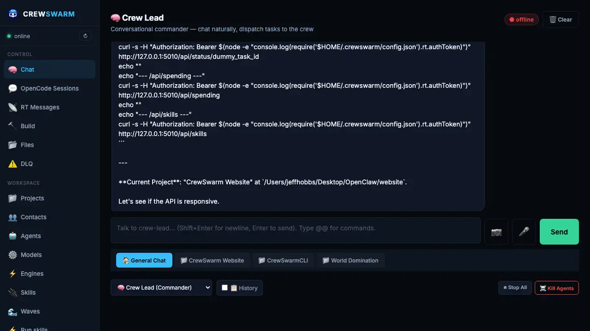

# crewswarm

**The local-first AI workspace for people who want real files, real services, and real control.**

crewswarm is an open-source local-first AI workspace for software development. It combines a real orchestration runtime, multi-agent routing, project-aware chat/history, local coding surfaces, and MCP/editor integrations into one stack you can run yourself.

[](LICENSE)
[](https://nodejs.org)
[](https://crewswarm.ai)

---

## crewswarm



**The local-first AI workspace.** Dashboard, multi-agent orchestration, project-aware chat, real-time service monitoring, and multi-engine execution in one stack.

- **Local-first control plane:** Dashboard, Vibe, crewchat, and the same shared runtime.
- **Multi-engine execution:** Codex, Claude Code, Cursor, Gemini, OpenCode, and `crew-cli`.
- **Real project context:** Memory, history, services, and files persist beyond one chat tab.
- **One-file install:** Clone and run `bash install.sh` or the curl installer.

## Why this matters

Most AI dev tools give you one chat box, one model, or one editor plugin.

crewswarm gives you:
- a real orchestration backend
- multiple operator surfaces: Dashboard, Vibe, `crewchat`, SwiftBar
- multi-engine execution: Codex, Claude Code, Cursor, Gemini, OpenCode, `crew-cli`
- project-aware history and memory
- a local stack you can actually inspect, run, and extend

That makes it useful for:
- solo builders who want more than a chat sidebar
- AI-native engineering teams
- local-first users who do not want SaaS lock-in
- developers building their own agentic workflows and products

## Proof Points

- Real stack, not just prompts: dashboard, RT bus, `crew-lead`, sub-agents, MCP, Vibe, and `crewchat`
- Multiple production-like surfaces: browser IDE, service dashboard, native macOS chat app, menu bar controls
- 414 passing unit tests in the current suite
- smoke coverage for dashboard, `crew-lead`, Vibe, and `crewchat`
- Playwright coverage for Vibe editor/chat persistence flows
- one-file local install and non-interactive install flow for Cursor/Codex/headless setups

---

## Quickstart (Vibe Mode)

### 1. Requirements
- Node.js 20+
- OpenAI Codex CLI (`npm install -g @openai/codex`)

### 2. Install
```bash
git clone https://github.com/crewswarm/crewswarm
cd crewswarm
bash install.sh
```

One-file install on a fresh machine:
```bash
bash <(curl -fsSL https://raw.githubusercontent.com/crewswarm/crewswarm/main/install.sh)
```

### 3. Launch the Vibe
```bash
npm run vibe
# Open http://127.0.0.1:3333
```

### 4. Headless / agent-driven install

For Codex, Cursor, CI, or remote shells, `install.sh` now supports a real non-interactive path:

```bash
CREWSWARM_SETUP_MCP=1 \
CREWSWARM_START_NOW=1 \
bash install.sh --non-interactive
```

Optional env flags:
- `CREWSWARM_BUILD_CREWCHAT=1`
- `CREWSWARM_SETUP_TELEGRAM=1` with `TELEGRAM_BOT_TOKEN=...`
- `CREWSWARM_SETUP_WHATSAPP=1`
- `CREWSWARM_ENABLE_AUTONOMOUS=1`

---

## How it works

```
You: "Build a user auth API with tests"
        ↓
crew-lead   →  understands intent, dispatches to Codex
        ↓
Codex CLI   →  executes in local sandbox (@@WRITE_FILE)
        ↓
crew-vibe   →  streams diffs to dashboard, hides tool-calls
        ↓
Human:      →  "Explain that middleware logic" (Ask Mode)
```

No broadcast races. No duplicate work. Each agent gets exactly one task, from one dispatcher, with full context — and actually writes the files.

> **Demo:** type `"build me a REST API with JWT auth and tests"` in the dashboard chat → watch crew-pm plan it → crew-coder write the files → crew-qa audit them → crew-github commit. Takes ~3 minutes on Groq.

---

## Why crewswarm vs alternatives

| | crewswarm | LangChain/LangGraph | AutoGen | CrewAI |
|---|---|---|---|---|
| **Real file writes** | ✅ actual disk I/O | ⚠️ tools vary | ⚠️ tools vary | ⚠️ tools vary |
| **PM-led planning** | ✅ dedicated crew-pm | ❌ manual | ❌ manual | ⚠️ role-based |
| **Any model, any agent** | ✅ per-agent model | ⚠️ global config | ✅ per-agent | ⚠️ limited |
| **Persistent memory** | ✅ brain.md + session-log | ⚠️ vector store setup | ❌ | ⚠️ |
| **Local-first** | ✅ no cloud required | ⚠️ | ⚠️ | ⚠️ |
| **Dashboard + UI** | ✅ built-in | ❌ | ❌ | ❌ |
| **Telegram / WhatsApp** | ✅ built-in bridges | ❌ | ❌ | ❌ |
| **Free to start** | ✅ Groq free tier | ✅ | ✅ | ✅ |
| **Setup time** | ~5 min | hours | hours | 30 min |

---

## Features

- **Real tool execution** — Agents write files (`@@WRITE_FILE`), read them (`@@READ_FILE`), make directories (`@@MKDIR`), and run commands (`@@RUN_CMD`). Not simulated. Real disk I/O.
- **PM-led orchestration** — Natural language requirement → PM breaks into phased tasks → targeted dispatch to the right specialist.
- **Task pipeline DSL** — crew-lead can emit `@@PIPELINE [{"agent":"crew-coder","task":"..."},{"agent":"crew-qa","task":"..."}]` to chain sequential tasks automatically, with each step's result injected into the next.
- **Shared memory** — `brain.md`, `session-log.md`, `current-state.md`, and `orchestration-protocol.md` are injected into every agent's prompt. crew-scribe watches completed tasks and writes LLM-generated summaries back to `session-log.md`. Agents write durable facts to `brain.md` via `@@BRAIN:` tags.
- **Fault tolerance** — Retry with backoff, task leases, heartbeat checks. Failed coding tasks auto-escalate to `crew-fixer`. After max retries, tasks land in the Dead Letter Queue for dashboard replay.
- **Command approval gate** — `@@RUN_CMD` calls from non-trusted agents pause and show an approval toast in the dashboard (Allow / Deny with 60s countdown). Pre-approve patterns like `npm *` or `node *` in **Settings → Command Allowlist** so common commands run without prompting. Dangerous commands (`rm -rf`, `sudo`, `curl | bash`) are always hard-blocked.
- **Token / cost tracking** — Every LLM call captures token usage. Dashboard **Settings** shows total calls, tokens, and estimated cost with per-model breakdown.
- **Telegram** — Full bidirectional Telegram integration. Each chat gets an isolated crew-lead session. Agents reply directly to the sender.
- **Five execution engines** — Route any agent through **OpenCode** (persistent sessions), **Cursor CLI** (reasoning models), **Claude Code** (`claude -p`, full workspace context), **Codex CLI** (`codex exec`, workspace-write sandbox), or **Gemini CLI** (free via Google OAuth). Switch per-agent from the dashboard **Engines** tab.
- **Four control surfaces** — CLI (`crew-cli`), web dashboard (port 4319), macOS SwiftBar menu bar, and Telegram.
- **Any model, any agent** — Each agent runs its own model. Mix OpenAI, Anthropic, Groq, Mistral, DeepSeek, Perplexity, or local Ollama. Switch without restarting.
- **PM Loop** — Autonomous mode: reads a `ROADMAP.md`, dispatches one item at a time, self-extends when the roadmap empties.
- **Standalone** — Runs without any third-party orchestration service. Bring your own API keys; direct LLM calls only.

---

## Quickstart

### Requirements

- Node.js 20+
- API key for at least one LLM provider (Groq is free → [console.groq.com](https://console.groq.com))

### One-command install (macOS)

```bash
git clone https://github.com/crewswarm/crewswarm
cd crewswarm
bash install.sh
```

Or on a completely fresh machine (no clone needed):

```bash
bash <(curl -fsSL https://raw.githubusercontent.com/crewswarm/crewswarm/main/install.sh)
```

The installer:
- Checks Node.js 20+ (tells you how to get it if missing)
- Runs `npm install`
- Creates `~/.crewswarm/` with correct structure
- Writes default config with a random RT auth token
- Bootstraps all 10 agents defaulted to Groq Llama 3.3 70B
- Pre-approves `npm *`, `node *`, `npx *` in the command allowlist
- Adds a `crew-cli` alias to your shell
- Optionally wires MCP into Cursor / Claude Code / OpenCode
- Can run non-interactively with env flags for agent-driven setup

### Configure API keys

After install, open the dashboard **Providers** tab and paste at least one API key:

```bash
npm run dashboard
# Open http://127.0.0.1:4319 → Providers tab
```

Keys are saved to `~/.crewswarm/crewswarm.json`. Groq is free and the fastest way to get started.

### Start the crew

```bash
npm run restart-all
```

This starts: RT bus (18889) → agent bridges → crew-lead (5010) → dashboard (4319).

Then open **http://127.0.0.1:4319** and go to the **🧠 Chat** tab.

## Documentation

- [docs/README.md](docs/README.md) — documentation index
- [docs/ARCHITECTURE.md](docs/ARCHITECTURE.md) — system diagram, port map, request flow
- [docs/SETUP-NEW-AGENTS.md](docs/SETUP-NEW-AGENTS.md) — adding new agents
- [docs/MODEL-RECOMMENDATIONS.md](docs/MODEL-RECOMMENDATIONS.md) — model selection guide
- [docs/TROUBLESHOOTING.md](docs/TROUBLESHOOTING.md) — common issues and fixes
- [docs/UNIFIED-API.md](docs/UNIFIED-API.md) — REST API overview


### Run a build

```bash
# From the dashboard Chat tab — type naturally, crew-lead dispatches
# Or from the CLI:
crew-cli "Build a REST API for user authentication with JWT and tests"
```

### PM Loop (autonomous mode)

```bash
# Create a roadmap
node scripts/run.mjs "Build a SaaS MVP with auth, billing, and a dashboard"

# Start the loop — runs until every roadmap item is complete
PM_ROADMAP_FILE=./ROADMAP.md CREWSWARM_OUTPUT_DIR=./output node pm-loop.mjs
```

### Smoke checks

```bash
npm run smoke            # end-to-end flow test
npm run health           # verify paths, config, and running services
```

---

## The Crew

| Agent | Role | Default model |
|---|---|---|
| `crew-lead` | Conversational commander — chat, dispatch, pipeline orchestration | Gemini 2.5 Flash |
| `crew-pm` | Plans, breaks requirements into tasks, manages the roadmap | Grok 4.1 Fast |
| `crew-coder` | General implementation — files, APIs, scripts | GPT-5.3 Codex |
| `crew-coder-front` | Frontend specialist — HTML, CSS, JS, UI | GPT-5.3 Codex |
| `crew-coder-back` | Backend specialist — APIs, DBs, server logic | GPT-5.3 Codex |
| `crew-qa` | Tests, validation, HTML/accessibility audits | Gemini 2.5 Flash |
| `crew-fixer` | Debugging, patching failures — auto-escalated on coder failure | GPT-5.3 Codex |
| `crew-security` | Security audits, hardening | Gemini 2.5 Flash |
| `crew-github` | Git commits, PRs, branch management | Groq Llama 3.3 70B |
| `crew-copywriter` | Headlines, CTAs, product copy | Groq Llama 3.3 70B |
| `crew-main` | General orchestration fallback | Groq Llama 3.3 70B |

---

## Architecture

```
┌──────────────────────────────────────────────────────────────────┐
│                       Control Surfaces                           │
│  Dashboard (4319)  │  SwiftBar  │  Telegram  │  WhatsApp  │  CLI │
└────────────────────────────┬─────────────────────────────────────┘
                              │ HTTP (5010)
                         crew-lead.mjs
                   (chat · dispatch · pipelines · @@STOP/@@KILL)
                              │ WebSocket pub/sub
                 ┌────────────┴────────────┐
                 │  RT Bus (18889)          │  ← opencrew-rt-daemon.mjs
                 └────────────┬────────────┘
                              │ task.assigned / command.run_task
        ┌───────┬─────────────┼───────┬──────────┐
      crew-pm  crew-coder  crew-qa  crew-fixer  crew-github  …
                 │
              gateway-bridge.mjs (per-agent daemon)
                 ├── loads shared memory (brain.md, etc.)
                 ├── calls LLM directly (per-provider API)
                 ├── executes @@WRITE_FILE / @@READ_FILE / @@RUN_CMD
                 ├── approval gate for @@RUN_CMD
                 ├── Code Engine :4096 (OpenCode / Claude Code / Cursor / Codex)
                 └── retry → escalate to crew-fixer → DLQ

  MCP + OpenAI API (5020)  ← mcp-server.mjs (optional)
     ├── Cursor MCP · Claude Code MCP · OpenCode MCP · Codex MCP
     └── Open WebUI · LM Studio · Aider (/v1/chat/completions)

  memory/           ← shared agent context (markdown)
  crew-scribe.mjs   ← polls done.jsonl, writes brain.md + session-log.md
  DLQ               ← failed task replay queue
```

---

## Control Surfaces

### CLI

> **Standalone version:** The CLI is also available as a standalone npm package at [github.com/crewswarm/crew-cli](https://github.com/crewswarm/crew-cli)

```bash
npm run crew-cli -- "Build X"               # full PM orchestration
npm run crew-cli -- code "Create login"     # send to crew-coder
npm run crew-cli -- test "Test auth flow"   # send to crew-qa
npm run crew-cli -- fix "Debug timeout"     # send to crew-fixer
npm run crew-cli -- audit "Security review" # send to crew-security
npm run crew-cli -- --status                # check agent status
```

### Dashboard (http://127.0.0.1:4319)

| Tab | What it does |
|---|---|
| **💬 Sessions** | Active RT sessions and recent messages |
| **📡 RT Messages** | Live feed of every agent message on the bus |
| **🧠 Chat** | Conversational interface to crew-lead — type naturally, agents do work |
| **🔨 Build** | Start phased builds, run PM Loop, view output per project |
| **📁 Projects** | Create and manage projects, start/stop PM Loop per project |
| **🤖 Agents** | Assign models, edit system prompts, configure tool permissions |
| **⚙️ Providers** | Paste API keys for Groq, Anthropic, OpenAI, Perplexity, Mistral, DeepSeek, xAI, Ollama |
| **📡 Telegram** | Bot config, per-chatId conversation viewer, RT activity feed |
| **🔧 Services** | Restart/stop any managed service |
| **🛠 Settings** | Token usage + cost tracking, command allowlist (pre-approve `npm *`, `node *`, etc.) |
| **⚠️ DLQ** | Replay failed tasks |

### Telegram

```bash
# Start the Telegram bridge — chat with your crew from your phone
TELEGRAM_BOT_TOKEN=xxx npm run telegram
```

Each Telegram chatId gets its own isolated crew-lead session. Agent replies are forwarded back to the sender automatically.

### SwiftBar (macOS)

Install `contrib/swiftbar/openswitch.10s.sh` as a SwiftBar plugin for a menu bar status indicator and one-click agent controls.

---

## Configuration

### API keys & RT token

Managed through the dashboard **Providers** tab → saved to `~/.crewswarm/config.json`.

### Agent models

Set in the dashboard **Agents** tab or directly in `~/.crewswarm/crewswarm.json`:

```json
{
  "agents": [
    { "id": "crew-pm",    "model": "perplexity/sonar-pro" },
    { "id": "crew-coder", "model": "anthropic/claude-3-5-sonnet-20241022" },
    { "id": "crew-qa",    "model": "groq/llama-3.3-70b-versatile" }
  ]
}
```

### Command allowlist

Pre-approve shell commands in **Settings → Command Allowlist** so agents don't prompt for every `npm install`. Patterns use glob syntax (`npm *`, `node *`, `python *`). Hard-blocked commands (`rm -rf`, `sudo`, `curl | bash`) can never be allowlisted.

### Environment variables

| Variable | Description |
|---|---|
| `CREWSWARM_RT_AUTH_TOKEN` | Auth token for the RT message bus |
| `CREWSWARM_OUTPUT_DIR` | Where agents write files |
| `CREWSWARM_RT_URL` | RT bus URL (default: `ws://127.0.0.1:18889`) |
| `CREW_LEAD_PORT` | crew-lead HTTP port (default: 5010) |

---

## Project structure

```
crewswarm/
├── crew-lead.mjs             # conversational commander + pipeline DSL + approval relay
├── crew-cli.mjs              # unified CLI
├── gateway-bridge.mjs        # agent runtime — RT bus ↔ direct LLM ↔ tool execution
├── telegram-bridge.mjs       # Telegram ↔ crew-lead bridge (per-chatId sessions)
├── pm-loop.mjs               # autonomous PM loop (reads ROADMAP.md)
├── unified-orchestrator.mjs  # PM → parser → dispatch pipeline
├── phased-orchestrator.mjs   # phased build orchestrator
├── continuous-build.mjs      # continuous round-based builder
├── scripts/
│   ├── dashboard.mjs         # web dashboard server (port 4319)
│   ├── start-crew.mjs        # spawn RT daemon + all agent bridges + crew-scribe
│   ├── crew-scribe.mjs       # memory daemon — polls done.jsonl, writes brain.md + session-log.md
│   ├── opencrew-rt-daemon.mjs # WebSocket message bus (port 18889)
│   ├── crewswarm-flow-test.mjs # end-to-end integration test
│   ├── dlq-replay.mjs        # DLQ replay helper
│   ├── openswitchctl         # control script (status, send, start/stop, DLQ replay)
│   └── run.mjs               # canonical entrypoint
├── memory/                   # shared agent context (markdown files)
│   ├── brain.md              # persistent project knowledge — agents append @@BRAIN: facts
│   ├── session-log.md        # LLM-written task summaries from crew-scribe
│   ├── orchestration-protocol.md
│   └── agents.md
├── docs/                     # guides and references
├── contrib/swiftbar/         # macOS SwiftBar plugin
└── website/                  # crewswarm.ai marketing site
```

---

## More docs

- [Architecture](docs/ARCHITECTURE.md) — system diagram, port map, request flow
- [Orchestrator Guide](docs/ORCHESTRATOR-GUIDE.md) — how dispatch and pipelines work
- [Agent Setup](docs/SETUP-NEW-AGENTS.md) — adding custom agents
- [Model Recommendations](docs/MODEL-RECOMMENDATIONS.md) — per-agent model guide
- [Troubleshooting](docs/TROUBLESHOOTING.md)
- [Changelog](CHANGELOG.md)
- [Security Policy](SECURITY.md)
- [SwiftBar Plugin](contrib/swiftbar/README.md)

---

## Related Repositories

- **[crew-cli](https://github.com/crewswarm/crew-cli)** — Standalone CLI for agent execution and task orchestration (npm installable)
- _More coming soon:_ agent protocol specs, Docker orchestration, security toolkit

---

## License

MIT — use it, fork it, build on it.

---

<p align="center">
  <a href="https://crewswarm.ai">crewswarm.ai</a> · 
  <a href="https://github.com/crewswarm/crewswarm">GitHub</a>
</p>
