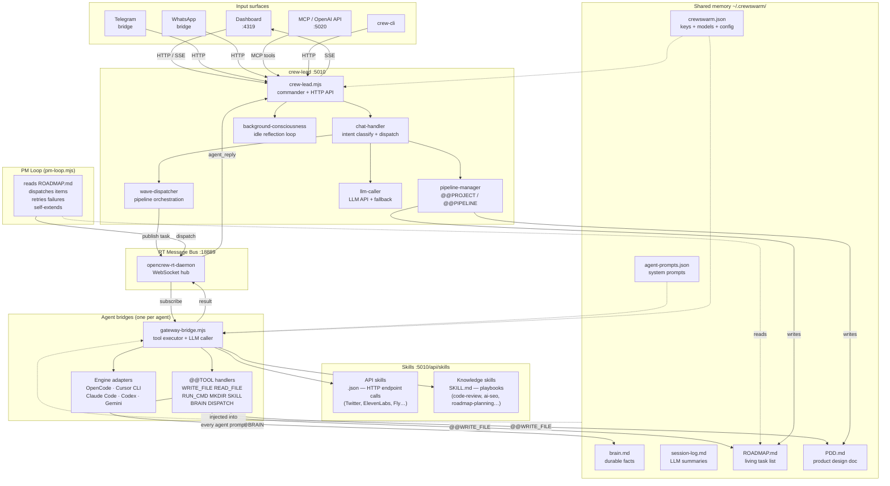

# CrewSwarm — System Architecture

## Overview

CrewSwarm is a local-first, PM-led multi-agent orchestration platform. A single natural-language requirement flows through a structured pipeline: crew-lead understands intent, crew-pm plans it, specialist agents execute it, crew-qa gates it, and crew-github ships it.

---

## System diagram



---

## Protocol — canonical message formats

### Dispatch envelope (crew-lead → RT bus → agent)

```json
{
  "channel": "command",
  "type": "command.run_task",
  "to": "crew-coder",
  "payload": {
    "content": "Write a REST endpoint for /users",
    "prompt":  "Write a REST endpoint for /users",
    "correlationId": "corr-a1b2c3d4",
    "projectDir": "/path/to/project",
    "useClaudeCode": false,
    "useCursorCli": false
  }
}
```

| Field | Type | Required | Description |
|---|---|---|---|
| `channel` | string | yes | Always `"command"` for task dispatches |
| `type` | string | yes | Always `"command.run_task"` |
| `to` | string | yes | Target agent RT ID (e.g. `"crew-coder"`) |
| `payload.content` | string | yes | Task text delivered to the agent |
| `payload.prompt` | string | yes | Alias for `content` (kept for compatibility) |
| `payload.correlationId` | string | no | Threads the task through all lifecycle events; auto-generated if omitted |
| `payload.projectDir` | string | no | Output directory for file-writing tasks |
| `payload.useClaudeCode` | bool | no | Route to Claude Code engine |
| `payload.useCursorCli` | bool | no | Route to Cursor CLI engine |

### Result envelope (agent → RT bus → crew-lead)

```json
{
  "status": "done",
  "taskId": "task-uuid-1234",
  "correlationId": "corr-a1b2c3d4",
  "agent": "crew-coder",
  "result": "Created /path/to/file.js with 42 lines.",
  "filesTouched": ["/path/to/file.js"],
  "error": null,
  "durationMs": 4200
}
```

| Field | Type | Description |
|---|---|---|
| `status` | `"done"` \| `"error"` \| `"timeout"` | Terminal state of the task |
| `taskId` | string | Matches the ID returned from `dispatchTask()` |
| `correlationId` | string | Echoed from dispatch; enables end-to-end tracing |
| `agent` | string | Agent that executed the task |
| `result` | string | Human-readable summary of what was done |
| `filesTouched` | string[] | Paths written or modified (empty if none) |
| `error` | string \| null | Error message if `status === "error"` |
| `durationMs` | number | Wall-clock time for the task |

### @@DISPATCH — agent-to-agent (coordinator agents only)

Only agents in `COORDINATOR_AGENT_IDS` (`crew-main`, `crew-pm`, `crew-orchestrator`) may use `@@DISPATCH`. Non-coordinator agents are silently blocked.

**Canonical JSON (preferred):**
```
@@DISPATCH {"agent":"crew-coder","task":"Write a REST endpoint for /users"}
```

**Legacy pipe format (still supported):**
```
@@DISPATCH:crew-coder|Write a REST endpoint for /users
```

Rules: self-dispatch blocked; empty agent/task ignored; enforcement in `lib/engines/rt-envelope.mjs`; contract tests in `test/unit/coordinator-dispatch.test.mjs`.

---

## Port map

| Port | Service | Protocol |
|---|---|---|
| **4319** | Dashboard (Vite frontend + REST API proxy) | HTTP / SSE |
| **5010** | crew-lead (commander, HTTP API, SSE bus) | HTTP / SSE |
| **18889** | RT Message Bus | WebSocket |
| **5020** | MCP server + OpenAI-compatible API | HTTP |
| **3000** | WhatsApp bridge (optional) | HTTP |

---

## Request flow — "build me X"

```
User types "build me X"
        │
        ▼
crew-lead (chat-handler)
  ├─ classifyTask → intent: build request
  ├─ PRD interview (if vague — asks 5 questions)
  └─ fires @@PIPELINE [wave 1: crew-pm + crew-copywriter + crew-main]
        │
        ▼ wave 1 (parallel)
  crew-pm    → problem-statement skill → scope-draft.md
  crew-copywriter → content research
  crew-main  → competitive landscape
        │
        ▼ wave 2 (parallel, gets wave-1 context)
  crew-coder-front → component breakdown
  crew-frontend    → design system proposal
  crew-qa          → test strategy
  crew-security    → security considerations
        │
        ▼ wave 3
  crew-pm → roadmap-planning skill → PDD.md + ROADMAP.md
        │
        ▼
crew-lead presents plan → user approves → build pipeline fires
        │
        ▼ build pipeline
  crew-coder → writes files
  crew-qa    → audits (quality gate)
  crew-fixer → patches failures (auto-inserted if QA fails)
  crew-qa    → re-audits
  crew-github → commits + opens PR
```

---

## Agent roster

| Agent | Role | Default engine |
|---|---|---|
| `crew-lead` | Commander, intent router | Direct LLM |
| `crew-pm` | Planning, roadmaps, PDD | Direct LLM |
| `crew-coder` | Full-stack coding | Direct LLM / OpenCode |
| `crew-coder-front` | HTML, CSS, JS, animations | Direct LLM / Cursor CLI |
| `crew-coder-back` | APIs, Node.js, databases | Direct LLM / OpenCode |
| `crew-frontend` | CSS, design systems | Direct LLM |
| `crew-qa` | Testing, auditing | Direct LLM |
| `crew-fixer` | Bug diagnosis and repair | Direct LLM |
| `crew-security` | Security review | Direct LLM |
| `crew-github` | Git, commits, PRs | Direct LLM (git tool) |
| `crew-copywriter` | Copy, docs, content | Direct LLM |
| `crew-main` | General coordinator, synthesis | Direct LLM / Claude Code |
| `crew-architect` | System design, ADRs | Direct LLM |
| `crew-seo` | SEO, GEO, structured data | Direct LLM |
| `crew-ml` | ML pipelines, model eval | Direct LLM |
| `crew-researcher` | Web research, ICP, market | Perplexity |

---

## Key files

```
CrewSwarm/
├── crew-lead.mjs              # Entry point — commander HTTP server :5010
├── gateway-bridge.mjs         # Per-agent daemon — LLM + tool execution
├── pm-loop.mjs                # Autonomous PM loop — reads ROADMAP.md
├── opencrew-rt-daemon.mjs     # RT WebSocket bus :18889
├── lib/
│   ├── crew-lead/
│   │   ├── chat-handler.mjs   # Intent classify, context inject, dispatch
│   │   ├── wave-dispatcher.mjs # @@PIPELINE wave execution + quality gate
│   │   ├── llm-caller.mjs     # LLM API calls, fallback, rate-limit handling
│   │   ├── prompts.mjs        # System prompt builder (Stinki's brain)
│   │   ├── http-server.mjs    # All REST endpoints + SSE
│   │   └── background.mjs     # Background consciousness loop
│   ├── engines/
│   │   ├── runners.mjs        # Cursor CLI, Claude Code, Gemini, Codex runners
│   │   ├── ouroboros.mjs      # LLM↔engine loop (STEP/DONE)
│   │   └── rt-envelope.mjs    # RT message envelope handling
│   ├── pipeline/
│   │   └── manager.mjs        # @@PROJECT draft/confirm, roadmap AI generation
│   ├── skills/
│   │   └── index.mjs          # Skill loader (JSON + SKILL.md), alias resolution
│   └── tools/
│       └── executor.mjs       # @@TOOL marker parser and executor
├── scripts/
│   ├── dashboard.mjs          # Dashboard API proxy :4319
│   ├── mcp-server.mjs         # MCP + OpenAI-compat API :5020
│   └── start-crew.mjs         # Spawn all agent bridges
├── frontend/
│   ├── src/                   # Vite source — app.js, tabs/, styles.css
│   └── dist/                  # Built output served by dashboard.mjs
├── telegram-bridge.mjs        # Telegram integration
├── whatsapp-bridge.mjs        # WhatsApp integration (Baileys)
├── test/
│   ├── unit/                  # 352 unit tests
│   ├── integration/           # 40 integration tests
│   └── e2e/                   # 41 E2E tests (requires live services)
└── ~/.crewswarm/              # User config (not in repo)
    ├── crewswarm.json         # API keys, agent models, env overrides
    ├── config.json            # RT auth token
    ├── agent-prompts.json     # System prompts per agent
    ├── skills/                # Installed skills (JSON + SKILL.md)
    ├── pipelines/             # Scheduled workflow definitions
    └── memory/                # brain.md, session-log.md, etc.
```
